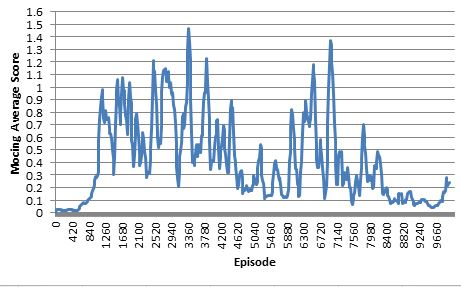

# Report - Collaboration with Tennis Agents using MADDPG

The work desribed in this report was completed as part of the submission for the Deep Reinforcement Learning nanodegree by Udacity.

## Introduction

In this project we implement the Multi Agent Deep Deterministic Policy Gradient algortihm (MADDPG) from [MADDPG] to train two agents to collbaorate in the UNity tennis environment.

We made use of the implementation of DDPG, the single agent case, provided in the Deep Reinforcement Learning course repository [DRLGIT], and modified the code to implement MADDPG.

## Implementation Details

The MADDPG algorithm from [MADDPG] is shown below.

Format: 

In this project we made use of the implementation of DDPG provided in the Deep Reinforcement Learning course repository [DRLGIT] and modifieid the code to implement. This was done by creating a class MADDPG to control the centralised componennts of the algorithm and another class DDPG to control the decentralised components.

The following files are included

* maddpg_tennis.py - Definee the MADDPG class contolling the centralised components and the class for the shared replay buffer.
* single_agent.py - Define the DDPG class for the decentralised components for each agent and the class for the noise.
* configuration.py - Stores the hyperparameters
* model.py Definies the module classes for the actor and critic networks
* tennis.ipynb - interactive notebook where the unity enviroment is called and the training loop is defined

### Network Architecture

The actor network maps states to actions with the following simple architecture.

* Two fully connected layers with 64 dimension followed by Relu activation

* An output layer to the action dimension follwed by tanh activation.

The critic network maps the state-action space to a single value using the following architecture;

* Two fully connected layers with 64 dimension followed by Relu activation

* A 1 dimensional output layer.

### Hyperparameters

The hyperparameters used are listed below. The biggest impact was found by reducing the number of layers of the actor and critic networks.

HyperParameter | Description | Value
------------ | ------------- | -------------  
BUFFER_SIZE | Size of the Replay buffer| 1e5
BATCH_SIZE | Size of each minibatch for gradient update| 512
GAMMA| The discounting factor| 0.99
TAU | Soft update parameter| 1e^-3
LR_ACTOR | Learning rate of the actor | 1e^-3
LR_CRITIC | Learning rate of the critic | 1e^-3
UPDATE_EVERY  | Number of timesteps between learning from experiences | 2
NUM_UPDATE| Number of updates performed every UPDATE_EVERY | 4
OU_MU | Drift parameter of the OU process used to add noise to the actions | 0
OU_THETA | Speed parameter of the OU process used to add noise to the actions | 0.15
OU_SIGMA | Volatility parameter of the OU process used to add noise to the actions | 0.2
EPSILON_START | Initial multiplier applied to OU Noise | 1
EPSILON_DECAY_PERIOD | Number of episodes over with EPSILON decays linearly | 3000
EPSILON_MIN | Min value of Epsilon , floor of decay | 0.1

## Results

After multiple unsuccesful experiments with different hyperparameters, a single training run solving the task was made.

The environment is considered solved when the max score between both agents average over 100 consecutive episodes exceeds 0.5.

Our agent achieved this after episode 1091.

The average of the max score over the previous 100 episodes is plotted below.

It can be seen that the training is quite unstable - the agents achieve good performance but then the performance actually gets worse with more training.

Format: 

## Ideas for Future Work
The current implementation could be improved by considering the following
* Systematic hyper parameter optimisation
* Using batch normalisation
* Using a prioritised replay buffer
* Better code structure for easier debugging

It would also be interesting to implement a form of collaboraitive training that can be performed online. That is where the agents do not need to share resources for training. The paper [MADDPG] discusses options for this.

## References

[DDPG] - [Continuous control with deep reinforcement learning](https://arxiv.org/abs/1509.02971)

[DRLGIT] - [DDPG implementation from Udacity](https://github.com/udacity/deep-reinforcement-learning/tree/master/ddpg-pendulum)

[MADDPG] - [Multi-Agent Actor-Critic for Mixed Cooperative-Competitive Environments](https://arxiv.org/pdf/1706.02275.pdf)
